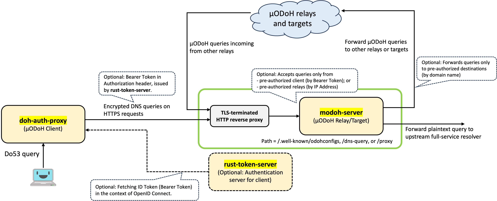

# doh-auth-proxy

[](LICENSE)


[](https://hub.docker.com/r/jqtype/doh-auth-proxy)

Local proxy for DoH, Oblivious DoH and ODoH-based Mutualized Oblivious DNS (ODoH-based &mu;ODNS; &mu;ODoH) supporting super-fast domain-based blocking and authenticated connection, written in Rust.

> **For the detailed information on &mu;ODNS, please also refer to [https://junkurihara.github.io/dns/](https://junkurihara.github.io/dns/).**

## Introduction

*DNS over HTTPS* (DoH) is an encrypted DNS protocol in which DNS queries and responses are exchanged with the target full-service resolver via HTTPS, i.e., over an encrypted-secure channel ([RFC8484](https://datatracker.ietf.org/doc/rfc8484)). To enhance the privacy of DoH, *Oblivious DNS over HTTPS* (ODoH) has been developed  ([RFC9230](https://datatracker.ietf.org/doc/rfc9230/)). ODoH leverages an intermediate *relay* (or *proxy*) and an end-to-end encryption ([HPKE](https://datatracker.ietf.org/doc/rfc9180/)) in order to decouple the client's IP address and content of his queries. *Mutualized Oblivious DNS over HTTPS* (&mu;ODoH) is an extension of ODoH, which has been (is still being) developed from the concern of the collusion between the relay and the target resolver and corruption of the client's privacy ([Resource](https://junkurihara.github.io/dns/)). To this end, &mu;ODNS leverages multiple relays towards the target resolver, where relays are selected in a random fashion and employed in a distributed manner.

`doh-auth-proxy` is client software that translates the standard DNS over port 53 (Do53) protocol to these three encrypted and privacy-enhanced DNS protocols. In other words, `doh-auth-proxy` protects the plaintext Do53 queries from being eavesdropped by encryption.

### Network structure of &mu;ODoH

Here is an example of the network architecture of &mu;ODoH.



The &mu;ODoH network consists of &mu;ODoH client ([`doh-auth-proxy`](https://github.com/junkurihara/doh-auth-proxy)), &mu;ODoH relay and target servers([`modoh-server`](https://github.com/junkurihara/modoh-server)), and supplementary authentication server ([`rust-token-server`](https://github.com/junkurihara/rust-token-server)). Note that when there exist two `modoh-server`, i.e., single relay and single target available, it exactly coincides with ODoH.

`doh-auth-proxy` and `modoh-server` supplementary provide access control function for queries, i.e., client authentication. In this mechanism, client queries are authenticated by Bearer token in their HTTP header. Note that to enable this client authentication, the `rust-token-server` must be configured and deployed on the Internet.

## Installing/building an executable binary

You can build an executable binary yourself by checking out this Git repository.

```shell
# debug mode
% cargo build

# release mode
% cargo build --release
```

Now you have a compiled executable binary `doh-auth-proxy` in `./target/debug/` or `./target/release/`.

## Basic Usage

### First step: Connecting to Google public DoH server

Start `doh-auth-proxy` as

```shell
% ./path/to/doh-auth-proxy --config config.toml
```

where we assume that `config.toml` is configured like follows.

```toml:config.toml
listen_addresses = ['127.0.0.1:50053', '[::1]:50053']
bootstrap_dns = ["1.1.1.1"]

target_urls = ["https://dns.google/dns-query"]
```

Now you can query through `127.0.0.1:50053` as

```shell
% dig github.com @localhost -p 50053
~~~~~~~
;; ANSWER SECTION:
github.com.             60      IN      A       52.69.186.44
~~~~~~~
```

The parameter `bootstrap_dns` is used to resolve the IP address of the host of `target_urls` (i.e., target DoH server). The `bootstrap_dns` allows non-standard DNS ports other than `53` and TCP queries, which can be specified as an url-like format, e.g., `tcp://1.1.1.1`, `tcp://127.0.0.1:12345`, `127.0.0.1:50053`, where UDP and port `53` are used if omitted.

If you run without `--config` option, i.e., simply hit `$ ./doh-auth-proxy`, the followings are applied as default parameters:

```:toml:config.toml
listen_addresses = ['127.0.0.1:50053', '[::1]:50053']
bootstrap_dns = ["1.1.1.1"]
endpoint_resolution_period = 60 # mins
healthcheck_period = 10 # mins
max_cache_size = 16384
target_urls = ["https://dns.google/dns-query"]
```

All the options are referred to below. Using your specific config file is recommended for better setting in your environment.

### Second step: Connecting to Cloudflare ODoH server via `odohrelay-ams` ODoH relay

Start `doh-auth-proxy` as

```shell
% ./path/to/doh-auth-proxy --config config.toml
```

where we assume that `config.toml` is configured as follows.

```toml:config.toml
listen_addresses = ['127.0.0.1:50053', '[::1]:50053']
bootstrap_dns = ["8.8.8.8"]

target_urls = ["https://odoh.cloudflare-dns.com/dns-query"]

[anonymization]
odoh_relay_urls = ["https://odoh-nl.alekberg.net:443/proxy"]
```

This example issues ODoH encrypted queries by an URL `https://odoh-nl.alekberg.net:443/proxy?targethost=odoh.cloudflare-dns.com&targetpath=/dns-query`.

Now you can query through `127.0.0.1:50053` as

```shell
% dig github.com @localhost -p 50053
~~~~~~~
;; ANSWER SECTION:
github.com.             11      IN      A       140.82.121.4
~~~~~~~
```

where this takes more round-trip time than the above ordinary DoH example due to the intermediate relay (especially when it is far from your location).

## Advanced usage

### Query plugins for name-based/domain-based blocking and overriding IP addresses

Optionally, `doh-auth-proxy` has functions of domain-based blocking and overriding (cloaking) IP Addresses. Former means that queries for domain names of specific patterns would be blocked and reject messages would be obtained. This can be done **super-fast** by enabling a trie-based data structure thanks to `Cedarwood` crate. Latter means that IP addresses you specified are always obtained for specific domain names.

To enable these functions, specify files defining blocking/overriding rules in `config.toml` as

```toml:config.toml
[plugins]

domains_blocked_file = "./blocklist.txt"
domains_overridden_file = "./overridelist.txt"
```

Refer to their example files for detailed format.

### Mutualized Oblivious DNS (&mu;ODNS) based on ODoH (&mu;ODoH)

`doh-auth-proxy` extends the ODoH protocol to the multiple-relay-based anonymization protocol, where its concept is called *Mutualized Oblivious DNS* (&mu;ODNS). We call by *&mu;ODoH* the ODoH-based &mu;ODNS.

To leverage the protocol, you need to run or find relay servers running &mu;ODoH. The implementation of the &mu;ODoH relay and target server is

- [`modoh-server`](https://github.com/junkurihara/modoh-server)

Note that the target resolver in &mu;ODoH is exactly same as that in the standard ODoH, and hence you can specify existing ODoH targets, e.g., Cloudflare's one `https://odoh.cloudflare-dns.com/dns-query`.

**When you run your relay servers, please make sure their security settings and fully understand the risk.** Everything must be done at your own risk.

See also the DNSCrypt-based &mu;ODNS as well, by referring to [our website](https://junkurihara.github.io/dns/).

## All options in a configuration file

```shell
USAGE:
    doh-auth-proxy --config <config_file>

FLAGS:
    -h, --help       Prints help information
    -V, --version    Prints version information

OPTIONS:
    -c, --config <config_file>    Configuration file path like "doh-auth-proxy.toml"
```

`config.toml` can be configured as follows.

```toml:config.toml
##############################################
#                                            #
#        doh-auth-proxy configuration        #
#                                            #
##############################################

##################################
#         Global settings        #
##################################

## Address to listen to.
listen_addresses = ['127.0.0.1:50053', '[::1]:50053']

## DNS (Do53) resolver address for bootstrap
bootstrap_dns = ['8.8.8.8']

## Minutes to re-resolve the IP addr of the nexthop and authentication endpoint url
## Ip addresses are first resolved by bootstrap DNS, after that, they will be resolved by (MO)DoH resolver itself.
# endpoint_resolution_period = 60

## Health check period in minitus. Check health of all path candidates and purge DNS cache.
# healthcheck_period = 10

## Cache entry size (Default 16384)
max_cache_size = 16384

## URL of (O)DoH target server like "https://dns.google/dns-query".
## You can specify multiple servers by repeatedly set this option, then one of given
## servers is randomly chosen every time.
target_urls = ["https://odoh.cloudflare-dns.com/dns-query"]

## According to the suggestion in "Designing for Tussle in Encrypted DNS" (HotNets'21),
## multiple (O)DoH servers should be specified and used in randomized fashion in this
## proxy when "target_randomization = true". Otherwise, the first one is always chosen.
## To this end, 'Global' objects should have Vec<DoHClient> object as clients configured
## with different target servers. Default value is true
target_randomization = true

## Use Get method to query if true. Default is false
# use_get_method = false


##################################
#         Auth settings          #
##################################
[authentication]

## (optional)
## API url to retrieve and refresh tokens and validation keys (jwks) like "https://example.com/v1.0",
## where /tokens and /refresh are used for login and refresh, respectively.
## Also /jwks is used for jwks retrieval.
# token_api = "https://token.api.example.org/v1.0"

## (optional)
## Credential env file path for login endpoint like "./credential.env"
# credential_file = "./.credential"


##################################
#         Anon settings          #
##################################
[anonymization]

## (optional) URL of ODoH nexthop relay server like "https://relay.example.com/relay"
odoh_relay_urls = ["https://odoh-nl.alekberg.net:443/proxy"]


## (optional)
## Choose ODoH relay in a randomized fashion from `odoh_relay_urls`.
odoh_relay_randomization = true

## (optional)
## URL of multiple-relay-based ODoH's intermediate relay like "https://relay.example.com/inter-relay".
## Specified relay is used after the relay of 'odoh_relay_url' in a randomized fashion.
# mid_relay_urls = ["htps://relay.url.after.surfdomeinen.example.org/proxy"]

## (optional)
## Maximum number of intermediate relays between nexthop and target.
# max_mid_relays = 2

##################################
#       Plugin settings          #
##################################
# [plugins]

## (optional)
## List of domain names to be blocked.
# domains_blocked_file = "./blocklist.txt"

## (optional)
## List of pairs of a domain name and an IPv4/v6 address, which will be overridden by specified address.
# domains_overridden_file = "./overridelist.txt"

```

## Docker container

You can run this proxy as a docker container, where the docker image is hosted at [Docker Hub](https://hub.docker.com/r/jqtype/doh-auth-proxy). You can run the docker container by appropriately configure env vers or an env file imported by the container.

See the [`./docker`](./docker) directory and [`./docker/README.md`](./docker/README.md) for the detailed configuration for the docker container.

## Authentication at the next hop node (DoH target or ODoH relay)

This proxy provides **authenticated connection** to a DoH target resolver (in DoH) or to an ODoH relay (in ODoH).
This function allows the nexthop node (DoH target/ODoH relay) to be private to users, and avoids unauthorized access.
**This additional function is introduced in order to prevent attacks against external servers through our relays.**

To leverage the function, an authentication server issuing Authorization Bearer tokens and an authentication-enabled DoH target/ODoH relay, given in the following.

- [`modoh-server`](https://github.com/junkurihara/modoh-server): Relay and target implementation for Oblivious DoH (ODoH) and ODoH-based Mutualized Oblivious DNS (ODoH-based &mu;ODNS; &mu;ODoH) supporting authenticated connection, written in Rust. Standard DoH target server is also supported.

- [`rust-token-server`](https://github.com/junkurihara/rust-token-server): An implementation of authentication server issueing `id_token` in the context of OIDC.

## Distribution of queries to multiple target resolvers and relays

Referring to the recent paper from Princeton University, we added a function to distribute queries among multiple target resolver. This is in order to support "design for choice".

> A. Hounsel, et al., "Designing for Tussle in Encrypted DNS", ACM HotNets'21

Currently if you specify multiple target resolvers and `target_randomization = true` in `config.toml`, your query is dispatched towards one of targets chosen in a random fashion. Otherwise, the first one is always selected.

From the same perspective of distribution of queries, our implementation enables the **relay randomization** in (Mutualized) Oblivious DNS over HTTPS simultaneously with the target randomization. This can be enabled by `odoh_relay_randomization = true` in `config.toml`.

We plan to implement kinds of 'round-robin' based distribution and other variants.

## Notes

ODoH implementation follows [RFC9230](https://datatracker.ietf.org/doc/rfc9230/).
